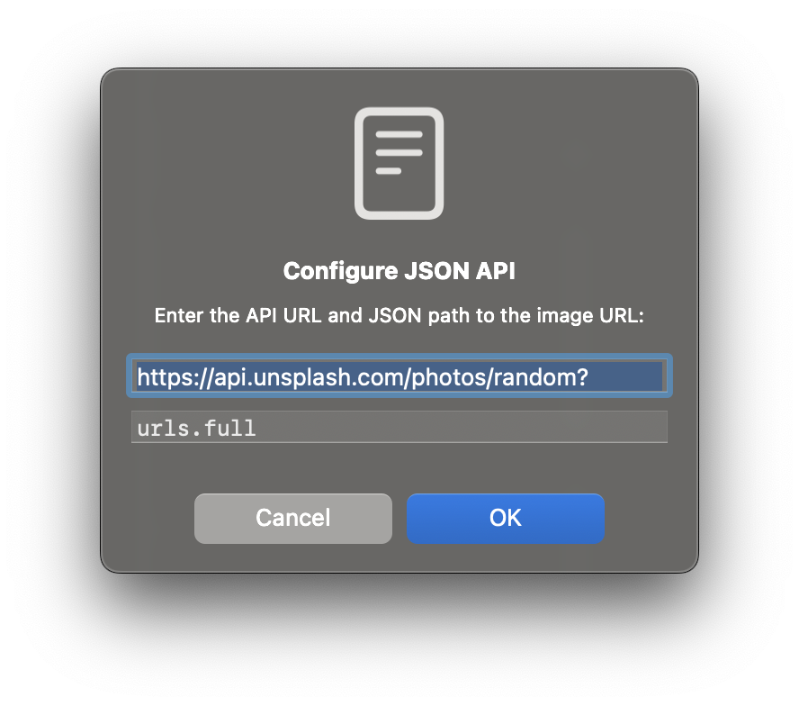

# Wallpaper Changer

A macOS menu bar application that automatically changes your desktop wallpaper at customizable intervals. [Download the latest here](https://github.com/bunchsoft/WallpaperChanger/releases)

This project was an example trying to build a simple "vibe coded" application.

## Features

-   🖼️ Automatically changes your desktop wallpaper at customizable intervals
-   ⏱️ Set refresh intervals from 30 seconds to 24 hours
-   🔄 Manually refresh wallpaper with a single click
-   🌐 Multiple wallpaper sources:
    -   Random images from [picsum.photos](https://picsum.photos)
    -   Custom static URL
    -   JSON API with selector for dynamic sources
-   ⚙️ Easy configuration through menu bar

## Installation

### Option 1: Download Release

1. Download the latest release from the [Releases page](https://github.com/bunchsoft/WallpaperChanger/releases)
2. Extract the zip file
3. Move WallpaperChanger.app to your Applications folder
4. Launch the application

### Option 2: Build from Source

1. Clone this repository
2. Open Terminal and navigate to the project directory
3. Build the application:

    #### Option A: Build as Command Line Tool

    ```
    cd WallpaperChanger
    ./build.sh
    ```

    The built application will be in the project directory as `WallpaperChanger`

    #### Option B: Build as macOS App Bundle

    ```
    cd WallpaperChanger
    ./build_app.sh
    ```

    The built application will be in `build/WallpaperChanger.app`

4. Copy the application to your Applications folder or run it directly

## Development

### Continuous Integration and Deployment

This project uses GitHub Actions for continuous integration and automated releases:

-   Every push to the `main` branch triggers a build of the application
-   Creating a new tag (e.g., `v1.0.0`) automatically:
    -   Builds the application
    -   Creates a GitHub release
    -   Attaches the built application as a downloadable asset

### Creating a New Release

#### Option 1: Using the Release Script (Recommended)

The easiest way to create a new release is to use the provided script:

```bash
./create_release.sh 1.0.0
```

Replace `1.0.0` with your desired version number. The script will:

1. Update the version in `Sources/WallpaperChanger/Info.plist`
2. Commit the changes
3. Create and push a tag (e.g., `v1.0.0`)
4. GitHub Actions will automatically build and publish the release

#### Option 2: Manual Process

If you prefer to create a release manually:

1. Update the version in `Sources/WallpaperChanger/Info.plist`
2. Commit your changes to the `main` branch
3. Create and push a new tag:
    ```
    git tag v1.0.0
    git push origin v1.0.0
    ```
4. GitHub Actions will automatically build and publish the release

## Usage

1. Launch the application
2. The app will appear as an icon in your menu bar (photo icon)
3. Click the icon to access the menu
4. Use the menu to:
    - Refresh wallpaper immediately
    - Change refresh interval
    - Change image source
    - Quit the application

## Configuration

### Refresh Interval

You can set how often the wallpaper changes from the menu:

-   Change Interval → Select from options ranging from 30 seconds to 24 hours

### Wallpaper Sources

The app supports three types of wallpaper sources:

1. **Random (picsum.photos)**

    - Uses random images from picsum.photos
    - Automatically adapts to your screen resolution

2. **Static URL**

    - Enter a direct URL to an image file
    - The image will be used as your wallpaper

3. **JSON API**

    - Enter an API URL that returns JSON
    - Specify a JSON path to extract the image URL
    - Example: If your API returns `{"data": {"imageUrl": "https://example.com/image.jpg"}}`, use the JSON path `data.imageUrl`

    - **Unsplash API Example**:
        1. Create an application at [Unsplash Developers](https://unsplash.com/oauth/applications)
        2. Use a URL like: `https://api.unsplash.com/photos/random?orientation=landscape&client_id=YOUR_CLIENT_ID_HERE`
        3. Set the JSON path to `urls.full` or `urls.regular`



## Requirements

-   macOS 12.0 or later

## License

This project is licensed under the WTFPL License - see the LICENSE file for details.
